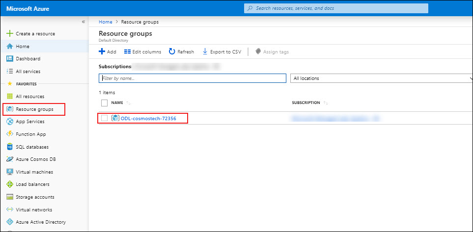
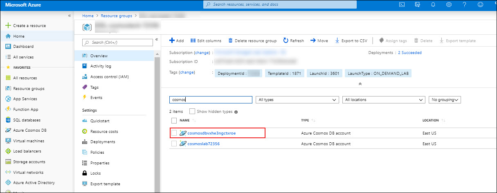
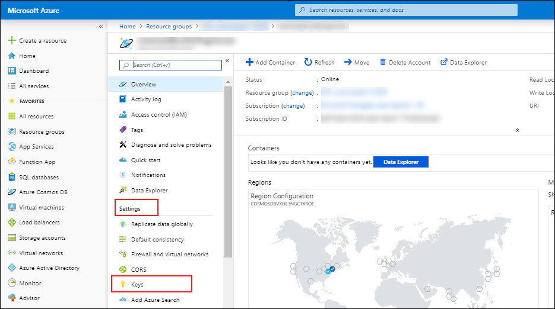

### Retrieve Account Credentials

1. In a new window, sign in to the **Azure Portal** (<http://portal.azure.com>).

1. On the left side of the portal, click the **Resource groups** link.

1. In the **Resource groups** blade, locate and select the **cosmoslabs** *Resource Group*.

     

1. In the **cosmoslabs** blade, select the **Azure Cosmos DB** account you recently created.

     

1. In the **Azure Cosmos DB** blade, locate the **Settings** section and click the **Keys** link.

     

1. In the **Keys** pane, record the values in the **CONNECTION STRING**, **URI** and **PRIMARY KEY** fields. You will use these values later in this lab.

     
