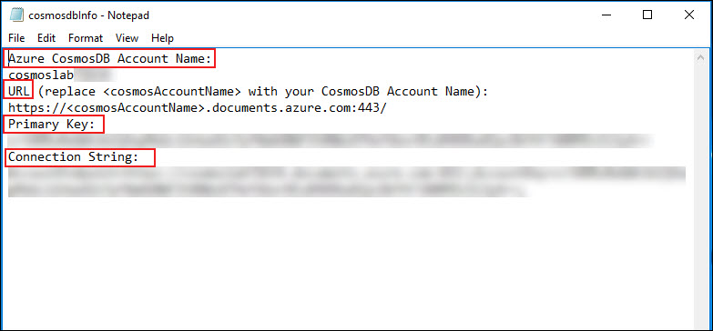

### Retrieve Azure CosmosDB Account Credentials

1. On the left side of the desktop, click on the **cosmosInfo.txt** text file.
   
    
 
1. You will get the values of  **CONNECTION STRING**, **URI** and **PRIMARY KEY** for your **Cosmos DB** account.

     

1. On your local machine, locate the **CosmosLabs** folder in C drive **lab** folder.

     
